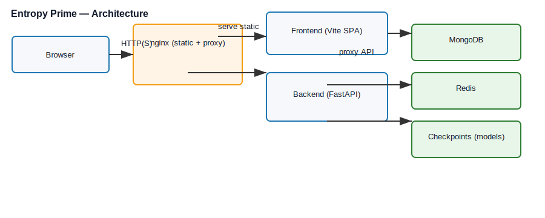
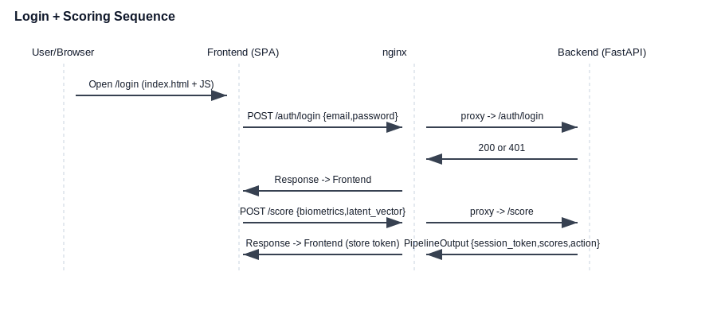

# Entropy Prime — Phase 2 Demo Guide

Short, simple, end-to-end explanation of what the project does, how it is deployed with Docker, and what each component/endpoints do. Includes diagrams and a demo checklist so you can present the prototype clearly.

---

## Abstract (one paragraph)

Entropy Prime is a prototype “zero-trust” authentication demo that augments normal email/password login with behavioral biometrics (keystroke/pointer signals). The frontend (SPA) collects biometric signals while the user types, then calls the backend API to authenticate and to submit biometric data to a 4-stage inference pipeline. The app runs as a Docker Compose stack: `nginx` serves the SPA and reverse-proxies API calls to the FastAPI backend, which stores users and sessions in MongoDB and uses Redis for caching/rate-limits. The backend references trained model checkpoints from the `checkpoints/` folder to run inference.

---

## High-level architecture



### Architecture Diagram Breakdown

The diagram is organized into **5 layers** from bottom to top:

1. **Data/State Layer (bottom):**
   - **MongoDB**: Persistent datastore for users, sessions, authentication logs, honeypot signals, and audit trails. Used by the backend for all CRUD operations.
   - **Redis Cache**: Fast in-memory store for rate-limiting counters, cached session tokens, and temporary authentication state.
   - **Model Checkpoints**: Pre-trained ML models (CNN1D, DQN, PPO) stored in the `checkpoints/` folder; loaded at backend startup for inference.
   - **File System**: Docker volumes for logs, static assets, and persistent data.

2. **API / Business Logic Layer (middle):**
   - **Auth Module** (`/auth/register`, `/auth/login`, `/auth/logout`): Handles user registration with Argon2 hashing and session token creation.
   - **Session/Token Management** (`/session/verify`, `/me`): Validates and manages active sessions; queries MongoDB for user details.
   - **Biometric Pipeline** (`/score` endpoint): Orchestrates the 4-stage inference pipeline (Biometric → Honeypot → Governor → Watchdog).
   - **Admin APIs** (`/admin/models-status`, `/admin/telemetry`): Debug and monitoring endpoints for developers.

3. **Frontend Layer (top-right):**
   - React SPA built with Vite; loaded once from nginx and runs entirely in the browser.
   - Captures user interactions (keystroke/pointer biometrics) via the SDK.
   - Manages local session tokens and routing between Login, Register, and Dashboard pages.
   - All API calls are made via the `api.js` fetch wrapper (relative URLs, no CORS issues).

4. **Proxy/Edge Layer (top-center):**
   - nginx acts as a reverse proxy: static files go to the browser directly, API calls are forwarded to the backend.
   - Rate-limiting and caching rules ensure API stability and reduce backend load.
   - HTTPS termination and request routing prevent the SPA catch-all from intercepting API responses.

5. **Client Layer (top-left):**
   - The user's web browser sends HTTP(S) requests to nginx.
   - Displays the login form, collects credentials, and submits biometric signals.

### Key Data Flows:
- **Register/Login**: Browser → nginx → backend → MongoDB (verify credentials) → session_token → frontend (store locally)
- **Biometric Score**: Frontend → nginx → backend → runs 4 stages in parallel or sequence → queries MongoDB/Redis as needed → returns JSON
- **Model Inference**: Backend loads .pt files on startup; during `/score`, each stage reads from loaded models in RAM.

---

## Login + Scoring sequence



### Sequence Diagram Explanation

This diagram shows the **step-by-step message flow** during a user login and biometric scoring session:

#### Step 1: Load Login Page
- User opens `http://localhost/login` (or navigates to it).
- Browser sends HTTP GET to nginx.
- nginx proxies to backend SPA handler, which returns `index.html`.
- Frontend JS loads, initializing the React app and biometric SDK.

#### Step 2: User Enters Credentials
- User types email and password into the login form.
- **Simultaneously**, the biometric SDK (in the browser) captures keystroke timings, pointer movements, and patterns.
- These signals are stored locally in the frontend and will be sent later to `/score`.

#### Step 3: Submit Login Credentials
- User clicks "Submit" or presses Enter.
- Frontend calls `POST /auth/login` with email and plain password.
- nginx intercepts and proxies to the backend (`POST /auth/login`).
- Backend:
  1. Looks up the user by email in MongoDB.
  2. Retrieves the stored Argon2 hash.
  3. Verifies the plain password against the hash using `PasswordHasher().verify()`.
  4. If match: creates a session in MongoDB and returns `200 { session_token, user_id, email }`.
  5. If no match: returns `401 { detail: "Invalid credentials" }`.
- nginx proxies the response back to the frontend.
- Frontend displays success/error message.

#### Step 4: Submit Biometric Score (if login succeeded)
- After successful login, the frontend calls `POST /score` with:
  - The collected biometric signals (keystroke timing, pointer data).
  - The latent vector computed by the SDK.
  - User agent, server load, and other metadata.
- nginx proxies to backend `/score` handler.
- Backend **orchestrator** runs the 4-stage pipeline **in sequence**:
  - **Stage 1 (Biometric)**: CNN1D extracts features (theta, h_exp) from keystroke/pointer signals.
  - **Stage 2 (Honeypot)**: MAB classifier decides if user should be shadowed or routed to a synthetic challenge.
  - **Stage 3 (Governor)**: DQN/PPO selects Argon2 parameters and behavioral actions.
  - **Stage 4 (Watchdog)**: Continuous monitoring for identity drift; recommends actions (ok, passive_reauth, etc.).
- Backend returns `PipelineOutput` containing:
  - `session_token`, `humanity_score`, `entropy_score`, `action_label`.
  - Per-stage results and confidence scores.
  - Recommended next actions for the UI.
- Frontend receives the response, stores the session token, and updates the UI (dashboard, threat alerts, etc.).

### Key Takeaways:
- **nginx acts as a transparent proxy**: the frontend doesn't know it's being routed; it just sends requests to relative URLs.
- **Authentication happens before biometric scoring**: the `/score` endpoint is only called after a successful login.
- **Biometric data is completely optional**: the login flow works without biometrics; the `/score` endpoint is a secondary enrichment.
- **All communication is JSON**: the backend speaks only JSON; HTML is only returned for static assets (via nginx).

---

## What Docker does here (each service)

- `nginx` (container): serves the built SPA (`index.html`, JS/CSS) and reverse-proxies API routes (`/auth/`, `/score`, `/api/`, `/password/`, `/session/`, etc.) to the backend. Also applies caching and rate-limiting. Config: `nginx/nginx.conf`.
- `backend` (container): runs the FastAPI application (handlers + 4-stage inference pipeline). Reads model checkpoints from `checkpoints/` and connects to MongoDB & Redis. Dockerfile builds a production image that bundles static assets into the backend image.
- `mongodb` (container): persistent store for users, sessions, honeypot logs, and admin data. Configured in `docker-compose.yml` and initialized using `mongo/init.js` if present.
- `redis` (container): lightweight cache and rate-limit store, used by nginx/backends for short-lived state.
- Composer: `docker-compose.yml` wires the services, environment variables, healthchecks and networks. Use `docker compose up -d --build` to run the whole stack.

---

## What `nginx` does (details)

- Serves static files from `/usr/share/nginx/html` (the Vite build), so the browser can load the SPA with the same origin as the API.
- Proxies API paths to the backend. This allows the frontend to use relative URLs (no CORS problems).
- Applies rate-limits and caching rules for static assets in `nginx/nginx.conf`.

Common nginx gotchas:
- If a proxied API path is not configured (missing `location` block), the SPA catch-all may return `index.html` for that API URL. That causes JSON parse errors and HTTP 405/HTML responses. Ensure API locations exist for `/score`, `/auth/`, `/password/`, `/session/`, etc.

---

## What MongoDB does (details)

- Stores `users` collection with fields like `email`, `password_hash`, `is_active`.
- Stores `sessions` collection: `session_token`, `user_id`, `latent_vector`, `expires_at`.
- Stores honeypot and audit logs used by the pipeline and admin dashboard.
- Connection is configured via `MONGODB_URL` / `MONGO_PASSWORD` environment variables in `docker-compose.yml` or your local `.env`/`all.env`.

---

## Important endpoints (what they do)

- `POST /auth/register` — Register a new user. Body: `{ email, plain_password }`. Creates user document and returns 201.
- `POST /auth/login` — Login. Body: `{ email, plain_password }`. Verifies argon2 hash; on success creates a session and returns `{ session_token, user_id, email }`.
- `POST /auth/logout` — Invalidate a session token.
- `POST /score` — Submit biometric payload to the 4-stage pipeline. Body: biometric features, latent vector, user agent, server_load. Returns `PipelineOutput` containing `session_token`, `humanity_score`, `entropy_score`, `action_label`, and per-stage metadata.
- `POST /password/hash` — Compute a hash using chosen Argon2 params (used by UI to show or test hashing results).
- `POST /password/verify` — Verify a plain password against a stored hash.
- `POST /session/verify` — Watchdog heartbeat for session verification.
- `POST /telemetry` — Collects events/telemetry (used for analytics).
- `GET /health` — Health check (used by docker-compose healthchecks).
- Admin endpoints: `/admin/*` and `/admin/models-status` — require admin keys; return model / pipeline debug info.

For code: main handlers live in `backend/main.py` and pipeline orchestration in `backend/models/orchestrator.py`.

---

## 4-stage pipeline (plain words)

1. Stage 1 — Biometric extraction: raw keystroke and pointer signals are normalized and converted into features (theta, h_exp, latent_vector).
2. Stage 2 — Honeypot: classifier decides whether to shadow the user or route them to a synthetic challenge (and selects a MAB arm when shadowing).
3. Stage 3 — Governor (DQN + PPO): determines Argon2 hashing parameters (memory/time/parallelism) and may select behavioral actions (e.g., stricter reauth flows).
4. Stage 4 — Watchdog: continuous checks for identity drift and recommends actions (ok, passive_reauth, disable_sensitive_apis, force_logout).

The orchestrator composes these results into the `PipelineOutput` returned by `/score`.

---

## Demo checklist (commands and steps)

1. Make sure local envs are set (copy `.env.example` → `.env` or populate `all.env`):

```powershell
# Example (PowerShell)
set -Machine EP_SESSION_SECRET=replace_with_secure_value
set -Machine MONGO_PASSWORD=your_mongo_pass
set -Machine REDIS_PASSWORD=your_redis_pass
```

2. Start Docker Compose (from repo root):

```bash
docker compose up -d --build
```

3. Verify containers and logs:

```bash
docker ps --filter "name=entropy_"
docker logs entropy_backend --tail 200
docker logs entropy_nginx --tail 200
```

4. Open the demo:

 - Visit `http://localhost/login` in a browser.
 - Register a test user and log in.
 - Observe backend logs showing `Registered` and `Login` messages and `/score` pipeline logs.

5. If you see JSON parse errors in the frontend, verify nginx returned JSON (not HTML). Check `nginx` logs to ensure requests are proxied rather than served by the SPA catch-all.

---

## Troubleshooting quick reference

- 405 / HTML returned: nginx is routing to SPA. Fix: add `location` block for the API route in `nginx/nginx.conf` and reload nginx (rebuild container).
- 500 with PPO/DQN matrix errors: model checkpoint mismatch or missing checkpoint — confirm files in `checkpoints/` and correct `EP_*_CHECKPOINT` env vars.
- Mongo auth failures: check `MONGO_PASSWORD` and the `MONGODB_URL` used by the container.

---

## Where to read code (quick pointers)

- `backend/main.py` — API handlers and app startup
- `backend/models/orchestrator.py` — pipeline orchestration (Stage 1→4 aggregation)
- `backend/models/*.py` — per-stage logic (see `stage1_biometric.py`, `stage2_honeypot.py`, `stage3_governor.py`, `stage4_watchdog.py`)
- `src/pages/LoginPage.jsx` — login UI flow and orchestration of login → score
- `src/services/api.js` — frontend HTTP client wrapper and endpoints
- `nginx/nginx.conf` — static serving + proxy rules
- `docker-compose.yml` — service definitions and env wiring

---

If you want I will:

- produce a single-slide markdown (or PDF) summary with these diagrams for your presentation, or
- create a short automated smoke-test script that performs register → login → score and prints the responses.

Tell me which one you prefer and I'll add it to the repo.
