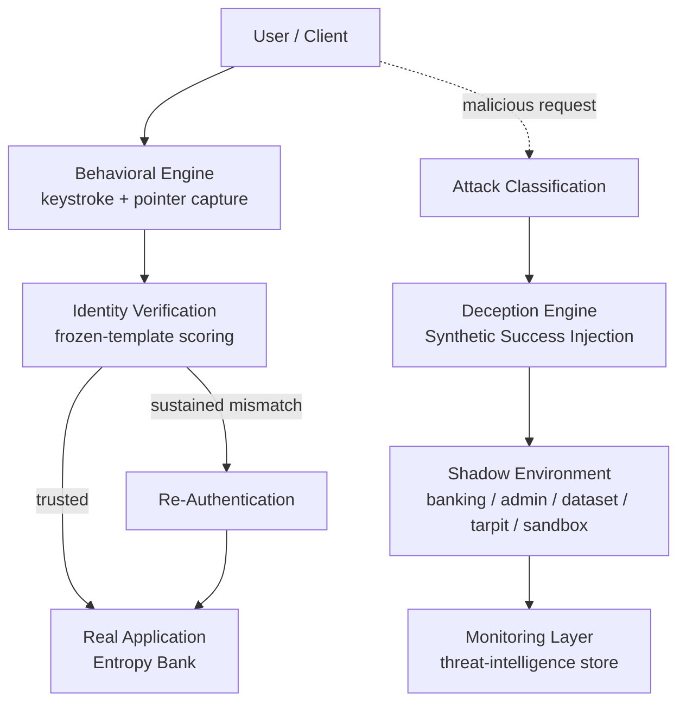
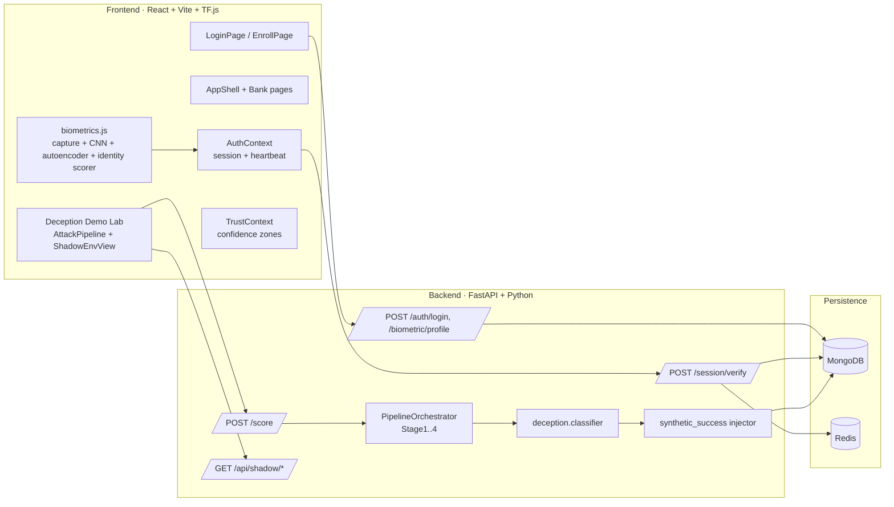
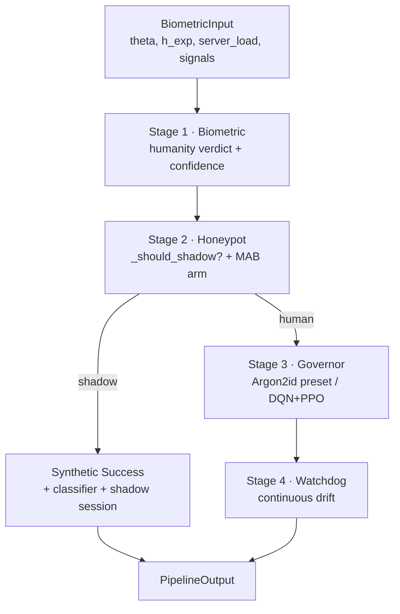
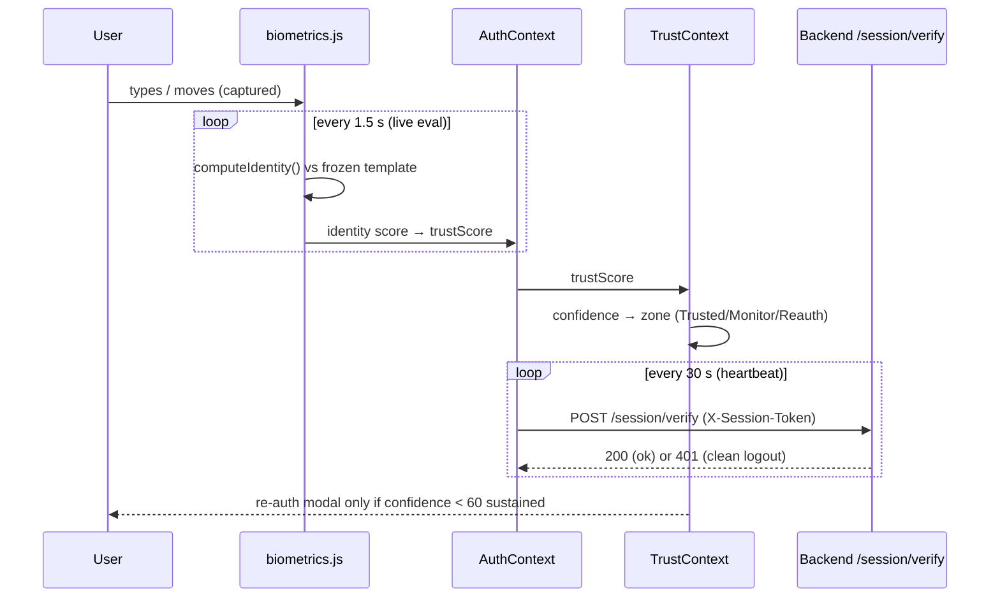
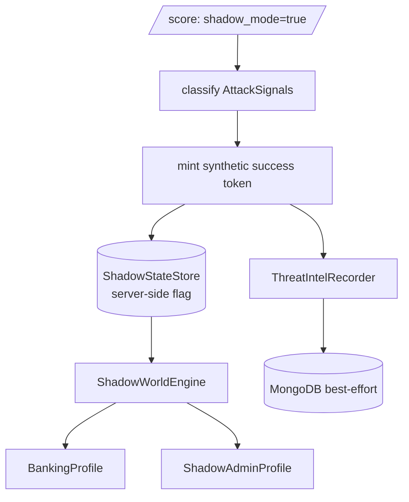

# Entropy Prime — System Architecture

## 1. High-level pipeline

The system is organised as a layered pipeline. A user's interaction is observed
by the behavioural engine, identity is continuously verified, malicious traffic
is classified and routed by the deception engine into a shadow environment, and
all activity feeds the monitoring layer.

## 2. Component architecture

## 3. Four-stage backend pipeline

The `PipelineOrchestrator` executes four stages per `/score` call:

- **Stage 1 — Biometric:** maps the humanity signal `theta` to a verdict
  (BOT / SUSPECT / HUMAN) with a confidence band.
- **Stage 2 — Honeypot:** decides shadow routing (`_should_shadow`) and selects
  a deception arm via a Multi-Armed Bandit; on shadow, hands off to the
  deception control plane.
- **Stage 3 — Governor:** selects an Argon2id hardening preset (skipped for
  shadow traffic, which uses an economy preset).
- **Stage 4 — Watchdog:** the continuous-drift signal used by the heartbeat.

## 4. Continuous-authentication data flow

## 5. Deception control plane

## 6. Key architectural principles

- **Detection ≠ disclosure:** classified attackers receive a normal success
  response; the "this is shadow" fact lives only server-side.
- **Frozen baseline:** the enrolment template is immutable; verification never
  adapts it, so an impostor cannot become the new baseline.
- **Graceful degradation:** when MongoDB is unreachable the backend falls back
  to an in-memory mock; in-process stores keep the demo functional.
- **Additive design:** the deception layer composes the existing pipeline
  without modifying it.
