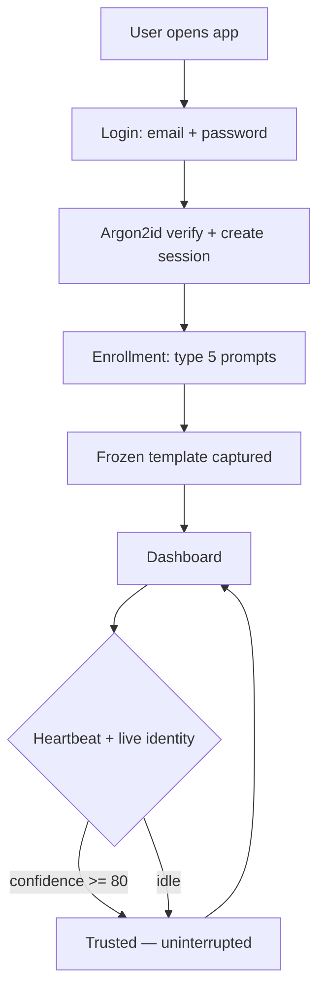
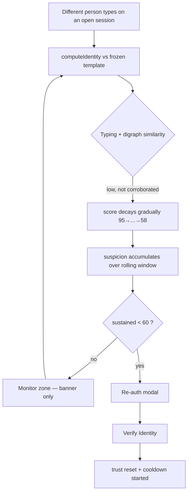
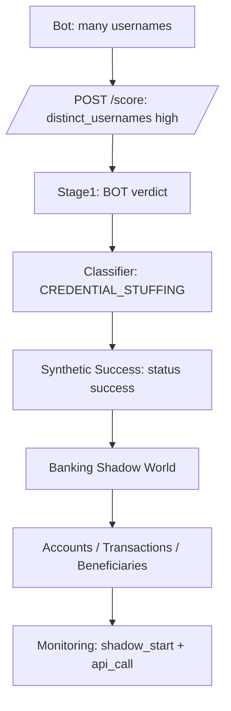
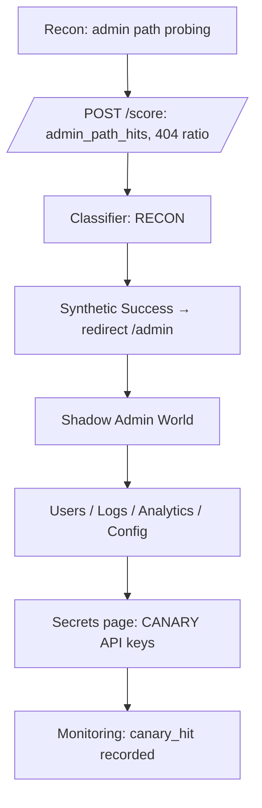
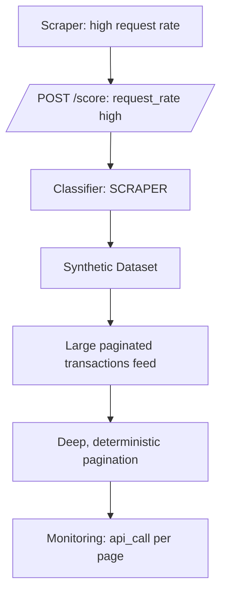
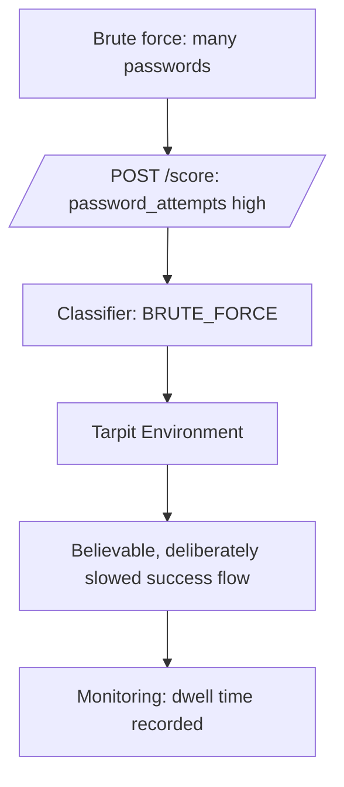
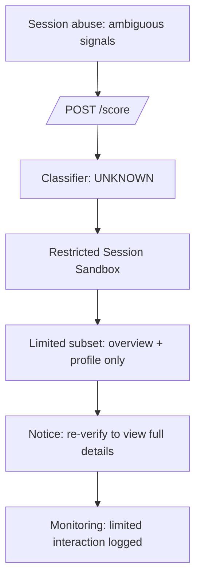

# Entropy Prime — End-to-End Workflows

## 1. Normal User Flow

## 2. Impostor Detection Flow

## 3. Credential Stuffing Flow

## 4. Reconnaissance Flow

## 5. Data Scraper Flow

## 6. Brute Force Flow

## 7. Session Hijacking Flow

> In the delivered prototype the classifier has five classes; Session Hijacking
> maps to UNKNOWN and is presented as a restricted sandbox at the UI layer. A
> dedicated "session abuse" class is a documented roadmap item.
